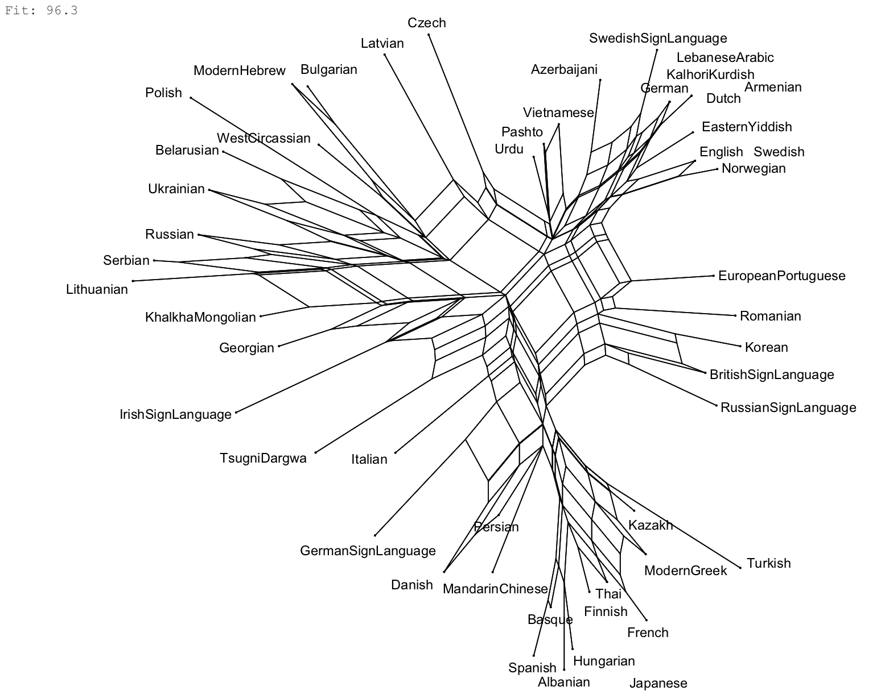

<style type="text/css">
.main-container {
    max-width: 1170px;
    
}
</style>


```{r, include=FALSE, echo=FALSE}
library(tidyverse)
library(lingtypology)
library(readr)
library(DT)

df_orig <- read.csv("data.csv", na.strings=c("","NA"))
df_orig %>%
  filter(truth_word == "yes") %>%
  select(-"id_number", -"researcher", -"iso", -"family", -"consultant", -"truth_word", -"word_group") %>%
  select(-contains("_comment"))-> df


df %>%
  mutate(across(.cols = c(4:ncol(df)), .fns = function(x) ifelse(!is.na(x), "+", ""))) -> df

```


## Questionnaire results {.tabset}

### All functions

```{r echo = FALSE, results = 'asis', message=FALSE, warning=FALSE}
datatable(
  data = df,
  filter = "top",
  extensions = 'FixedColumns',
  options = list(fixedColumns = list(leftColumns = 4), scrollX = TRUE, dom = 'Bfrtip',
                 columnDefs = list(list(className = 'dt-center', targets = "_all")))
  
)

```

---


### Generalized extended functions


```{r, include=FALSE, echo=FALSE}
df %>%
  mutate(int = ifelse(int_adj == "+" | int_npred == "+" | int_pred == "+",
                        "+", "")) %>%
  mutate(conc = ifelse(conc_pred2 == "+" | conc_adj == "+" | conc_adv == "+",
                        "+", "")) %>%
  select("language_name", "word", "translation", "int", "tag", "affirm", "conc", "subj") -> df_gen
df_gen
```

```{r echo = FALSE, results = 'asis', message=FALSE, warning=FALSE}
datatable(
  data = df_gen,
  filter = "top",
  extensions = 'FixedColumns',
  options = list(scrollX = TRUE, dom = 'Bfrtip',
                 columnDefs = list(list(className = 'dt-center', targets = "_all")))
  
)
```

---

## Maps {.tabset}

```{r, include=FALSE, echo=FALSE}
df_gen %>%
  group_by(language_name) %>%
  summarize(across(int:subj, ~ ifelse(("+" %in% .x), "attested", "not attested"))) -> df_per_lng

#restore iso-codes
df_orig %>%
  select("language_name", "iso") %>%
  unique() -> iso_codes
df_gen_iso <- merge (df_per_lng, iso_codes, by = "language_name")
```


```{r, echo=FALSE, include=FALSE}
#for neighbbor-net
df %>%
  group_by(language_name) %>%
  summarize(across(right:subj, ~ ifelse(("+" %in% .x), "1", "0"))) -> df
write.csv(df, "df.csv")
```


### Intensification

```{r, echo=FALSE, out.width = '100%'}
  
map.feature(languages = lang.iso(df_gen_iso$iso),
            features = df_gen_iso$int,
            label = df_gen_iso$language_name,
            tile = "Esri.WorldPhysical",
            color = c("#f46d43", "#404040"),
            width = 6,
            title = "int"
            )
```


### Tag-question

```{r, echo=FALSE, out.width = '100%'}
  
map.feature(languages = lang.iso(df_gen_iso$iso),
            features = df_gen_iso$tag,
            label = df_gen_iso$language_name,
            tile = "Esri.WorldPhysical",
            color = c("#f46d43", "#404040"),
            width = 6,
            title = "tag"
            )
```

### Affirmation

```{r, echo=FALSE, out.width = '100%'}
  
map.feature(languages = lang.iso(df_gen_iso$iso),
            features = df_gen_iso$affirm,
            label = df_gen_iso$language_name,
            tile = "Esri.WorldPhysical",
            color = c("#f46d43", "#404040"),
            width = 6,
            title = "affirm"
            )
```


### Concessive

```{r, echo=FALSE, out.width = '100%'}
  
map.feature(languages = lang.iso(df_gen_iso$iso),
            features = df_gen_iso$conc,
            label = df_gen_iso$language_name,
            tile = "Esri.WorldPhysical",
            color = c("#f46d43", "#404040"),
            width = 6,
            title = "conc"
            )
```

### Subjective evaluation


```{r, echo=FALSE, out.width = '100%'}
  
map.feature(languages = lang.iso(df_gen_iso$iso),
            features = df_gen_iso$subj,
            label = df_gen_iso$language_name,
            tile = "Esri.WorldPhysical",
            color = c("#f46d43", "#404040"),
            width = 6,
            title = "subj"
            )
```


## Neighbor-net

{#id .class width=80%}


